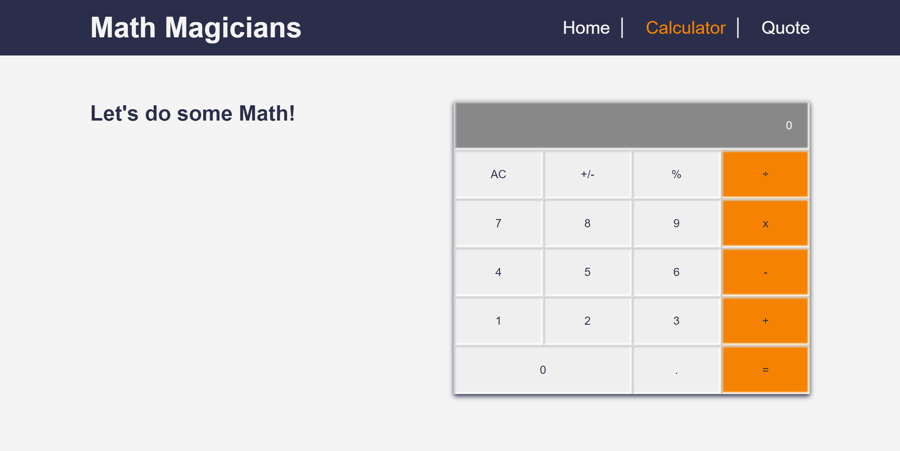
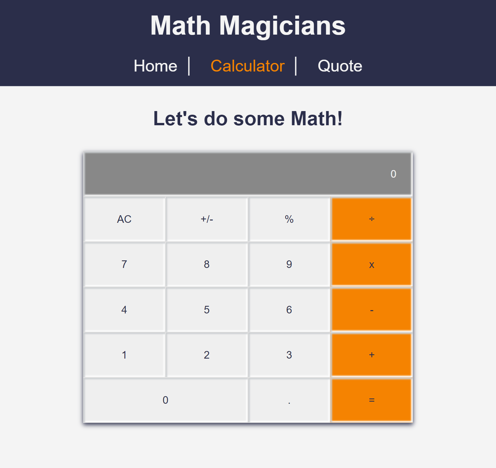

# Math magicians

> "Math magicians" is a website for all fans of mathematics. It is a Single Page App (SPA) that allows users to make simple calculations and Read a random math-related quote.

## Built With

- React

## Getting Started

### Setup

#### To get a local copy up and running follow these simple example steps.

- Click the green `Code` button on the repo
- In your local PC, open your terminal in the folder you would like to clone the project.
- Clone the repo with the command: `git clone (copied link)`; like so: `git clone git@github.com:AyoubMS/math-magicians.git`
- On the terminal, navigate into the directory like so: `cd math-magicians`
- Checkout to branch name like so: `git checkout [branch name]`
- Run `npm i` to install the dependencies
- Run `npm start` to start the application

#### To run Test

- Run `npm run test`

### Usage

- Running `npm start` should start the server on the browser
- Start solving math
- Checkout random quotes

## Author

👤 **Ayoub Chahir **

- [GitHub](https://github.com/AyoubMS)
- [LinkedIn](https://www.linkedin.com/in/ayoub-chahir/)

## Deploy

- Netlify: https://math-magician-ayoub-26628d.netlify.live/
- Heroku: https://math-magicians-1.herokuapp.com/

## 🤝 Contributing

Contributions, issues, and feature requests are welcome!

Feel free to check the [issues page](https://github.com/AyoubM/math-magicians/issues).

## Show your support

Give a ⭐️ if you like this project!

## Acknowledgments

- Hat tip to anyone whose design template was used
- My friends
- Inspiration
- etc
